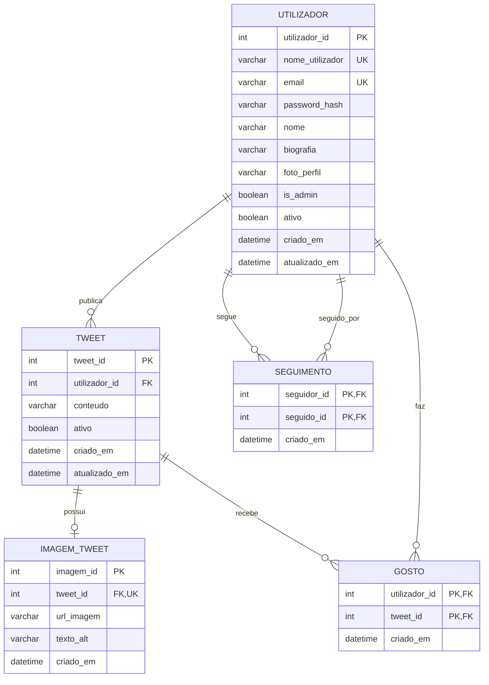

# Modelo de Base de Dados - Clone Twitter/X

## 1. Descricao do tema

O sistema proposto e uma base de dados para um clone simplificado do Twitter/X. A aplicacao permite o registo e autenticacao de utilizadores, publicacao de tweets com limite de 280 caracteres, publicacao opcional de uma imagem por tweet, relacoes de seguimento entre utilizadores, gostos em tweets e funcionalidades de backoffice para administracao de utilizadores e tweets.

A base de dados suporta estes requisitos atraves de tabelas que representam os utilizadores, os tweets, as imagens dos tweets, os seguimentos e os gostos. O backoffice e suportado atraves do atributo `is_admin` na tabela de utilizadores e dos atributos de estado, como `ativo`, que permitem desativar utilizadores ou tweets sem eliminar imediatamente o historico.

## 2. Entidades

### Utilizador

Representa uma conta registada no sistema.

Atributos:

- `utilizador_id`: chave primaria.
- `nome_utilizador`: nome unico usado para login e identificacao publica.
- `email`: email unico do utilizador.
- `password_hash`: password guardada de forma segura, nunca em texto simples.
- `nome`: nome visivel do utilizador.
- `biografia`: pequena descricao do perfil.
- `foto_perfil`: URL ou caminho da imagem de perfil.
- `is_admin`: indica se o utilizador tem permissoes de administracao.
- `ativo`: indica se a conta esta ativa.
- `criado_em`: data e hora de criacao da conta.
- `atualizado_em`: data e hora da ultima atualizacao.

### Tweet

Representa uma publicacao feita por um utilizador.

Atributos:

- `tweet_id`: chave primaria.
- `utilizador_id`: chave estrangeira para o autor do tweet.
- `conteudo`: texto do tweet, com limite de 280 caracteres.
- `ativo`: indica se o tweet esta visivel/ativo.
- `criado_em`: data e hora de publicacao.
- `atualizado_em`: data e hora da ultima alteracao.

### ImagemTweet

Representa a imagem opcional associada a um tweet.

Atributos:

- `imagem_id`: chave primaria.
- `tweet_id`: chave estrangeira para o tweet.
- `url_imagem`: URL ou caminho do ficheiro da imagem.
- `texto_alt`: texto alternativo da imagem.
- `criado_em`: data e hora de associacao da imagem.

### Seguimento

Representa a relacao em que um utilizador segue outro utilizador.

Atributos:

- `seguidor_id`: chave estrangeira para o utilizador que segue.
- `seguido_id`: chave estrangeira para o utilizador seguido.
- `criado_em`: data e hora em que o seguimento foi criado.

A chave primaria e composta por `seguidor_id` e `seguido_id`.

### Gosto

Representa um gosto dado por um utilizador a um tweet.

Atributos:

- `utilizador_id`: chave estrangeira para o utilizador que gostou.
- `tweet_id`: chave estrangeira para o tweet que recebeu o gosto.
- `criado_em`: data e hora em que o gosto foi criado.

A chave primaria e composta por `utilizador_id` e `tweet_id`.

## 3. Relacoes e cardinalidades

- Um `Utilizador` publica zero ou muitos `Tweet`.
- Um `Tweet` pertence obrigatoriamente a um unico `Utilizador`.
- Um `Tweet` pode ter zero ou uma `ImagemTweet`.
- Uma `ImagemTweet` pertence obrigatoriamente a um unico `Tweet`.
- Um `Utilizador` pode seguir zero ou muitos `Utilizador`.
- Um `Utilizador` pode ser seguido por zero ou muitos `Utilizador`.
- Um `Utilizador` pode gostar de zero ou muitos `Tweet`.
- Um `Tweet` pode receber zero ou muitos `Gosto`.

## 4. Diagrama EA em Mermaid

Este diagrama pode servir de referencia para desenhar a versao final em notacao Crow's Foot no MySQL Workbench.

## 5. Modelo relacional

UTILIZADOR(
    utilizador_id PK,
    nome_utilizador UNIQUE NOT NULL,
    email UNIQUE NOT NULL,
    password_hash NOT NULL,
    nome NOT NULL,
    biografia,
    foto_perfil,
    is_admin NOT NULL,
    ativo NOT NULL,
    criado_em NOT NULL,
    atualizado_em NOT NULL
)

TWEET(
    tweet_id PK,
    utilizador_id FK -> UTILIZADOR(utilizador_id),
    conteudo NOT NULL,
    ativo NOT NULL,
    criado_em NOT NULL,
    atualizado_em NOT NULL
)

IMAGEM_TWEET(
    imagem_id PK,
    tweet_id FK -> TWEET(tweet_id) UNIQUE,
    url_imagem NOT NULL,
    texto_alt,
    criado_em NOT NULL
)

SEGUIMENTO(
    seguidor_id FK -> UTILIZADOR(utilizador_id),
    seguido_id FK -> UTILIZADOR(utilizador_id),
    criado_em NOT NULL,
    PK(seguidor_id, seguido_id)
)

GOSTO(
    utilizador_id FK -> UTILIZADOR(utilizador_id),
    tweet_id FK -> TWEET(tweet_id),
    criado_em NOT NULL,
    PK(utilizador_id, tweet_id)
)

## 6. Restricoes de integridade

- RI 1: O atributo `utilizador_id` identifica unicamente cada utilizador.
- RI 2: O atributo `nome_utilizador` e obrigatorio e nao pode repetir-se.
- RI 3: O atributo `email` e obrigatorio e nao pode repetir-se.
- RI 4: O atributo `password_hash` e obrigatorio e deve guardar uma password encriptada/hasheada.
- RI 5: O atributo `nome` e obrigatorio.
- RI 6: Os atributos `is_admin` e `ativo` devem ter valores booleanos e valores por omissao.
- RI 7: O atributo `tweet_id` identifica unicamente cada tweet.
- RI 8: Todo o tweet deve estar associado a um utilizador existente.
- RI 9: O atributo `conteudo` e obrigatorio e deve ter entre 1 e 280 caracteres.
- RI 10: Uma imagem deve estar associada a um tweet existente.
- RI 11: Cada tweet pode ter no maximo uma imagem associada.
- RI 12: O atributo `url_imagem` e obrigatorio para cada imagem.
- RI 13: Um seguimento deve associar dois utilizadores existentes.
- RI 14: Um utilizador nao pode seguir o mesmo utilizador mais do que uma vez.
- RI 15: Um utilizador nao se pode seguir a si proprio.
- RI 16: Um gosto deve associar um utilizador existente a um tweet existente.
- RI 17: Um utilizador nao pode gostar do mesmo tweet mais do que uma vez.
- RI 18: As datas de criacao devem ser preenchidas automaticamente quando o registo e criado.
- RI 19: Quando um utilizador e apagado, os seus tweets, gostos e seguimentos associados sao tambem apagados por integridade referencial.
- RI 20: Quando um tweet e apagado, a imagem e os gostos associados sao tambem apagados por integridade referencial.

## 7. Normalizacao

### Primeira Forma Normal (1FN)

Todos os atributos possuem valores atomicos. Por exemplo, os gostos nao sao guardados como uma lista dentro da tabela `tweet`; cada gosto e representado por uma linha independente na tabela `gosto`.

### Segunda Forma Normal (2FN)

As tabelas com chave composta, como `seguimento` e `gosto`, nao possuem atributos dependentes apenas de uma parte da chave. O atributo `criado_em` depende da relacao completa: o momento em que um determinado utilizador seguiu outro ou gostou de um determinado tweet.

### Terceira Forma Normal (3FN)

Nao existem dependencias transitivas relevantes. Por exemplo, os dados do utilizador nao sao repetidos na tabela `tweet`; a tabela `tweet` guarda apenas `utilizador_id` e os restantes dados do autor ficam na tabela `utilizador`.

## 8. Decisoes justificadas

- Foi usado `password_hash` em vez de `password`, porque uma base de dados real nao deve guardar passwords em texto simples.
- Foi criado `imagem_tweet` como tabela separada para permitir controlar melhor os dados da imagem e manter o modelo extensivel.
- Foi usado `is_admin` na tabela `utilizador` para suportar o backoffice sem criar uma estrutura de permissoes demasiado complexa para o ambito do projeto.
- Foi usado `ativo` em `utilizador` e `tweet` para permitir gestao pelo backoffice sem eliminar imediatamente a informacao.
- As tabelas `seguimento` e `gosto` usam chaves primarias compostas para impedir duplicados de forma simples e eficiente.
